## Authors:
Meghana Gunuganti,
Ewin Hong,
Raghuveer Reddy Kalvakole,
Zach Murphy

#### Abstract:
This research paper intends to identify local urban Meso-level communities in Washington D.C. and immediate surrounding areas that have inadequate WiFi connectivity for the size of the population in that area. By identifying areas with high population density and low internet connectivity (referenced as WiFi desserts from here on out), we were able to ascertain which communities are the most in need of updated high-speed internet infrastructure. Our study identified that WiFi deserts are most heavily clustered in suburban areas in Northwestern Washington D.C., Springfield/Fairfax, and Hyattsville/College Park. Installing 5G cellular and fiber optic network infrastructure in these WiFi deserts will provide high-speed internet to populations where it’s needed most.
While conducting network site surveys is not new, they take a long time and can be very costly when conducted using traditional, physical methods. They also typically require the survey to be conducted in all geographic areas where network connectivity is desired. This paper provides a free, alternative way to narrow the scope of where focused traditional physical network surveys are required, making the overall process more efficient. Using crowd-sourced geo-referenced WiFi data for initial site survey analysis could provide government and/or commercial entities with a much more refined understanding of their networks before investing heavily in large scale, traditional surveys.

#### Introduction

In society, people are largely connected to significant data through the use of computers and smartphones.  In the mid-1990s to early 2000s, computers grew to a mainstream adoption due to the emerging technologies of the Internet.  These computers started out connecting to the Internet through analog landline phone calls.  As people started using the Internet much more, the technology needed to evolve with the increased demand and speeds.  This technological demand exceeded the landline capacity, the data could be transmitted through cable tv or digital data using phone wires.  While cable is still involved with the internet, the technology of cable internet is antiquated due to the physical limitations of data transfer through cables.  The next evolution of data transfer for the internet is fiber optics.  

Cell phone technology had a similar evolutionary timeline like the internet.  In late 2000s, cell phones were largely considered dumb where the cell phone provided minimal access to internet-based data.  When a person performed almost any internet-based activity during that time, the common choice was to use a computer instead of a cell phone.  Attempting to perform the same capability on a cell phone was not very efficient in the user experience or speed of data transfer.  Then Apple introduced the iPhone and this gave cell phones a boost in their usage.  After this introduction gave cell phones the name of smartphone due their expansive capabilities in connecting people to the internet while being mobile.  The smartphones have gone through two significant generational upgrades in cellular technology starting from 3G. 4G provided a boost in data throughput from 3G from 1-5mbps to around 50-100mbps realistically.  5G is suggested to have a large jump like 3G to 4G did and additionally provides a larger connectivity to various devices instead of connecting to a local Wi-Fi router.[2]

With the prior experiences of 3G and 4G, smartphone users are likely to have experienced an issue with their cellular service due to one of these situations: having a phone call randomly disconnects while being in a building or having little to no cellular service outside.  These two scenarios are caused by radio interference from the building or a cellular tower is not providing a strong signal to the phone.  With regards to having issues within a building, public or private Wi-Fi networks exist to bridge this gap.  So, with the second scenario, we will use the term ‘Wi-Fi desert’ as a geographic area where there are no to weak signaled, limited, or inaccessible Wi-Fi networks. [3]

To identify WiFi deserts, we acquired data from two sources. The first is a WiFi mapping application called WiGLE. [1]WiGLE aggregates user-generated content into a cloud database, which is accessible to users via their web interface or through their Application Program Interface (API). Our primary use of WiGLE’s content metadata is for geo-locational purposes but additional metadata could be used for follow-on analysis such as correlating geo-referenced addresses and/or cellular location data to router Basic Service Set Identifiers (BSSID) through convergence. Each of the 26,836 unique WiGLE records is a geo-located wireless access point (i.e.: router, mobile hotspot, etc.) that contains 15 fields after cleaning (See Figures 1.1.1 and 1.1.2). The second source of data was acquired from the
U.S. Census Bureau. Population estimates from 2018 were broken into 1,859 distinct ‘Census Block Groups’. [2] Each Census Block Group record contains 19 total fields (See Figure 1.2).

This paper discusses previous work on the importance and the uses of locating WiFi deserts concerning the 5G network towers installation, the present 5G infrastructure, and WiFi mapping and population density. The paper further discusses the data collection and pre-processing methods for further analysis. In the analysis we have created several visualizations based on our hypothesis using different methods that convey information about the WiFi deserts using different methods Log Normalized Using Standard Deviation Class Breaks, Log Normalized Using Quantile Class Breaks, etc. Then we have the results and conclusions discussing the outcomes of the analysis.
#### Literature Review:
##### 2.1 Why Locating WiFi Deserts is Important to 5G Network Installation:
The introduction of the 4G network was a revelation as the world saw tremendous speeds when compared to 3G networks. Now, the 5G network is around the corner and history is likely to repeat itself. [6] The future Wi-Fi Fifth Generation (5G) conversation community requires a better bandwidth if you want to obtain a higher rate of packet transfer. The 5G Wi-Fi communication system faces numerous technical challenges like consumer’s mobility, sudden channel variant, coordinated BS identification, shared spectrum communique, and intra-cellular & inter-cell interference. For the future, 5G wi-fi network, the range of customers will exponentially boom which makes the communication network ultra-dense.

Implementing the 5G network presents major technical challenges and gives results of massive multiple-input multiple- output (Massive MIMO) systems, technical design considerations of 5G data to future perspective for further research. The formidable necessities for 5G networks are already unleashing a flurry of creative thinking and a sense of urgency in bringing progressive new technologies to the truth. Identifying Wi-Fi deserts will enable network engineers to plan their 5G installation for maximum efficiency.[7]

Development of a joint optimization framework that may be used to simultaneously plan the placement of the subsequent-generation mobile infrastructure gets right of entry to the network in conjunction with its optical delivery counterpart. They must exploit extraordinary optical shipping network architectures and technologies that can be used to build an efficient network for 5G so that it will bring records between wi-fi cells and the principal office. Particularly, we equitably compare multiple architectures in phrases of fundamental requirements of the 5G community together with bandwidth requirements, put off budgets, deployment fees, the complexity of radio far-flung head, and the ability to aid superior wireless capabilities. [8]

To research the deployment fee of the entire 5G shipping and wireless networks, they expanded a joint optimization framework to optimally set up a fiber- primarily based community and 5G wi-fi community concurrently. Their analyses offer insights into modeling future-evidence optical shipping networks to realize 5G network deployment.[9]

Through the 10-12 month forecast period, the excessive-income and technologically- superior North America region will see heavy adoption of 5G offerings. In both Canada and the US, consumer 5G services were introduced, but adoption has now not been vigorous considering the minimal insurance of networks, whilst the Covid-19 pandemic, which has triggered supply chain delays and a good-sized recession in the global economic hobby, has also weighed on customer sentiment. Our updated estimates, relative to our previous forecasts, are even direr in our forecast timeframe. We expect the best 17.5mn 5G subscribers in North America by the end of 2020, but by the end of 2029, this number would push up to 406.9mn. The weak outlook was largely due to the weaker resistance among operators than expected, all of which needed remarkable strategies to 5G. Verizon, for instance, has concentrated solely on rollouts in the high-frequency spectrum band, which has a weaker coverage reach by a mile and this has resulted in stronger connectivity at the outset and continuous hand-offs between 4G and 5G networks. Alternatively, AT&T has deployed its network almost exclusively inside the 850 MHz low-band spectrum band, which has comparatively weaker potential and this has led to lower speeds than anticipated. [10]

In comparison, the shortage of a 5G- enabled iPhone in the cellphone line-up of Apple has further contributed to inactive uptake. Around the same period, the operators' enthusiasm in using 5G in suburban areas as an incentive for wired internet services, preferably for telephone services, has also contributed to the susceptibility of adoption of smartphones. Collectively, these elements have contributed to countless tales of clients, due to the inability of operators to reach the brand-new era's initial standards. [11]

The most important US carriers, led by AT&T, Verizon, and T-Mobile US have collaborated with companies to develop and expand their commercial services with 5G technology and promotions. Moreover, operators are focusing on the capabilities of NB-IoT, LTE-U, and LTE-A technology as compatible solutions supported by 5G in certain respects. Global areas ought to get a broad 4G system to advance to 5G since it is far from an evolutionary process. [12]

The improvement of 5G devices in 2019 has increased significantly. Nearly 100 countries are carrying out their own 5G trials and evaluations in 2019. At first, traditional wireless broadband networks are on the path to undergoing 5G improvements, with additional sophisticated technologies being designed and equally brought along with the evolution. If you want to push the initial call for 5G, it could be data-extensive industries and companies. 5G will continue to be implemented in particular metropolitan areas where the right foundation for technology exists. 5G is expected to provide opportunities for revenue increases for telecom providers, even in the early stages. 5G would change the industry and involve much more coordination between the different players in the business. New alliances, investments, and resistance will also result in this. For the achievement of 5G implementations, spectrum management, protocols, regulations, and licenses are significant components.  One of 5G's possible capabilities are network reduction, which could allow higher visitors across the different slices and additional connected devices.[13]

The cell phone has grown quickly in the past decade out of a minuscule monochrome computer Screen and poor computing capacity for one with an elevated Palm-sized screen, resolution, and computing power to rival a laptop. This transformation, together with an expanding bandwidth cache for hungry users demands for higher data volumes have been activated. Mobile data traffic is expected to rise more than 24 times between 2010 and 2015, and to increase more than 500 times between 2010 and 2020. With our project there will be a clear picture for the service providing companies to establish their infrastructure in the areas where the 5G network is not available by identifying the Wi-Fi desserts. [14]

This in essence has driven the introduction of 4G contracts and empowered operators to deploy 4G networks globally. To help the mobile industries in solving these problems some new technologies have evolved like Heterogeneous Networks which involve Multiple Radio Access Technologies, Device Communications, Carrier type, etc. There are also other technologies like Software Defined Cellular Networks, Massive MIMO, and 3D MIMO, Machine to Machine Communications, etc. [15]

Although there is currently no strong consensus between academics and industry on what is to be described by 5G we believe the future cellular 5G networks are wireless, a mixture of various supporting networks would be technologies, and it is going to be the greatest obstacle to make both of them work together. [16] 

###### Current 5G Infrastructure
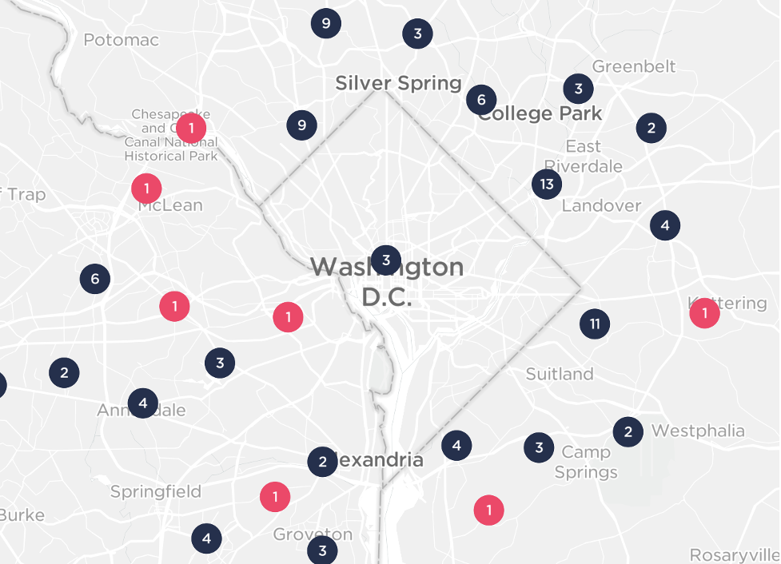  
<figcaption>Figure 2.2.1 – Ookla 5G Towers map focused on DC region [10]</figcaption>

According to Verizon, one of the leading Internet Service Providers (ISPs) for the 5G network, some areas in major cities in the U.S. have reached 5G speeds of over 1 Gbps (i.e.: 1,000 Mbps).
As the 5G technology rolls out, the company Ookla, who created speedtest.net for testing internet speed from ISPs, provides an interactive map to show the current and upcoming status of the 5G coverage in the area.  Figure 2.2.1 highlights that the primary geographic locations for 5G towers in our area of study are within downtown Washington D.C. and to the east, northeast, and northwest in Maryland, just outside the Washington D.C. boundary. Additionally, Figures 2.2.2, 2.2.3, & 2.2.4 show the number of ISPs who deliver internet download speeds of ~100 Mbps, ~250Mbps, & 1Gbps respectively.[16]

These graphics highlight that broadband ISPs tend to target the same locations as 5G and that 1Gpbs or faster broadband internet is centrally located in the northern D.C. metro area. This information provides some specific geographic focus areas for analysis in this paper, especially when overlaid with Wi-Fi hotspots and population density. [17]

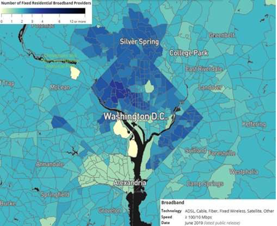
<figcaption>Figure 2.2.2 – FCC Broadband Map: # of Providers Over 100 Mbps [20]</figcaption>
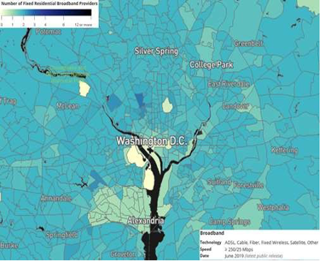
<figcaption>Figure 2.2.3 – FCC Broadband Map: # of Providers Over 250 Mbps [20]</figcaption>
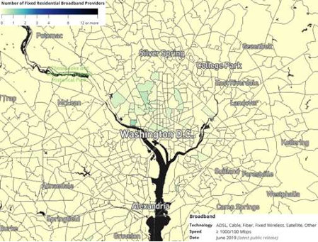
<figcaption>FCC Broadband Map: # of Providers Over 1 Gbps [20]</figcaption>

##### 2.3 WiFi Mapping and Population Density Use Case:
Wi-Fi mapping is not a new phenomenon but it is becoming more and more useful to big tech industries every day. According to Sapiezynski, “Wi-Fi networks are ubiquitous. In our population, 92% of all Wi-Fi scans detect at least one access point, and 33% detect more than 10 APs. In densely- populated areas, an average of 25 Access Points (AP) is visible in every scan, with population density explaining 50% of the variance of the number of APs.” See Figure 2.2.1. [18] In    this    paper, Sapiezynski converges Wi-Fi mapping data with cellular GPS data to highlight that geo-located Wi-Fi BSSIDs can be used to accurately depict individual mobility patterns. As such, the use of WiGLE records to predict Wi-Fi density in our study can be justified using Sapiezynski’s research as a basis. And although our study does not go so far as to predict the users of each router, aggregating our data with other sources could achieve such results. 

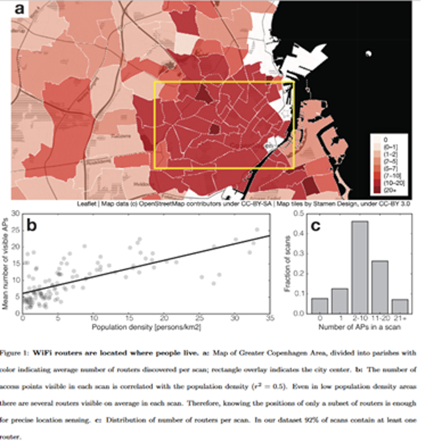
<figcaption>Figure 2.3.1 – WiFi Mapping in Coppenhagen [7]</figcaption>

#### Analysis Methodology
##### Data Acquisition:
###### WiGLE
WiGLE data was acquired using the company’s API. The first step was to create user accounts on the website to obtain API tokens/keys. [4] Once those were obtained, we realized that each call yielded at most 100 records but it didn’t matter how large the bounding box was for the query. Because of this, we requested unthrottled access from the site administrators. We did not get unthrottled access but did receive an increase in the number of calls we could make to the API per day (up to 500). To overcome this hurdle, we created a series of 270 smaller bounding boxes in a separate data frame. Then we iterated over that data frame with a loop to change the geographic area for each of the 270 API calls made. By iterating over smaller bounding boxes in this way we were able to obtain a much larger sample size per square mile within the D.C. Metro area. [19] 
###### U.S. Census Bureau:
U.S. Census Bureau data was acquired through two different sources. The first step was to obtain the estimated population for each Census Block Group within our designated geographic area of analysis. We did this through the Census Bureau’s interactive mapping application. [2] Due to size limitations, we downloaded the data in 30 different .csv files and compiled them into one single file. Next, we obtained Census Block Group shapefiles for Virginia, Maryland, and Washington D.C. from data.gov. [20] [21] [22]
##### Cleaning and Pre-processing:
###### Python
Python was used to call the WiGLE API and the ‘Requests’ package was used to fetch a JSON response. Then we extracted the results as a data frame using the ‘Pandas’ package. The next step was to rename the latitude and longitude fields to ‘lat’ and ‘lon’ to facilitate an easier import into ArcGIS. At this point, we could export our data into a .csv format. Because of record limitations, the number of WiGLE calls increased significantly over what was originally planned. This resulted in several separate .csv files that needed to be merged before further analysis could be completed. This was accomplished with a loop that added the results of each API call to a single, all-encompassing data frame. Once this was done, we used the ‘drop_duplicates’ function to ensure we had unique records and then exported to a .csv file.
###### ArcGIS:
We used ArcGIS Pro to clean and process all our census data. First, we used the mapping function to join the Maryland, D.C., and Virginia Census Block Group shapefiles into one single shapefile. Then we selected only Census Block Groups that geographically contained WiGLE records and deleted the rest. Last, we joined the Census Block Group attribute table with the population record table. This ensured that our Census Block Group shapefile had the associated population value metadata so that we could conduct population density analysis and cross-reference that with WiGLE record density to determine a targetability index score for each Census Block Group. 
##### Data Analysis
###### ArcGIS
Next, we imported our WiGLE dataset into ArcGIS Pro using the ‘Add Data’ feature, which added the .csv file as a new standalone table in the program. After adding the table, we created a graphic overlay for the WiGLE table that depicted the geographic locations (points) of each record and its associated metadata (see figure 3.3.1). Then we counted the total number of WiGLE records per each Block Group and conducted density analysis using a k-nearest neighbor algorithm over for the entire analyzed area (see figure 3.3.2). This allowed us to visualize the total Wi-Fi density for the region to draw initial conclusions. Then we created an additional column in the Census Block Group attribute table that contained the number of WiGLE records per Block Group and calculated Wi-Fi Density for each Census Block Group based on its area. Finally, now that we had both population and Wi-Fi density layers are broken down by Block Group, we could calculate a Targetability Index Score for advertising and/or network infrastructure emplacement using the formula annotated in section 4.1 below – see figure 3.3.3.

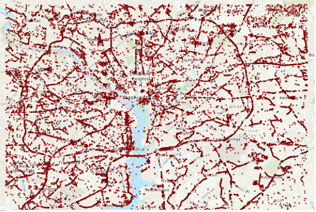
<figcaption>Figure 3.3.1 – Wireless Access Point Overlay</figcaption>

##### Evaluation Methodology:
###### Formula:
To identify which Census Block Groups were the most targetable for 5G cellular and fiber optic network infrastructure installation, we first had to calculate population density for each Census Block Group based on its area. This was accomplished using the formula: 
(Shape_Area)/(Estimate_Pop)=Population_Density. Then the Wi-Fi density was calculated for each Census Block Group with the formula: 
Shape_Area/WiGle_Records=Wifi_Density. 
Finally, the Targetability Index Score was calculated for each Census Block Group using the formula:
1000*Population_Density /Wifi_Density =Targetability_Index_Score. Identifying the Targetability Index Score allows for the systematic ranking of each Census Block Group and better geographical visualization of the data for analytical purposes.
###### Hypothesis 1: 
There will be a high number of metropolitan statistical areas (7-8) that have relatively high targetability levels. These areas will be located outside of the Washington D.C. city center, more generally focused on suburban communities.
###### Hypothesis 2:
There will be a low number of metropolitan statistical areas (3-4) that have relatively high targetability levels. These areas will be located inside the Washington D.C. city center, more generally focused on urban communities.
###### 4.4-Visual Modeling Techniques
4.4.1 Method 1: 
Using this method there are 17 different classes with a targetability index score between -1.6 (highest targetability) and 2.1 (lowest targetability). Red census block groups indicate a higher targetability index score and green census block groups indicate a lower targetability score.

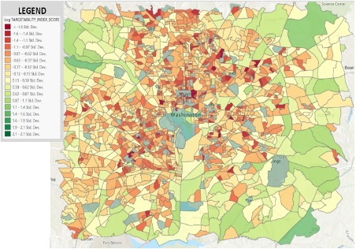
<figcaption>Method 1 - 4.4.1: Log Normalized Using Standard Deviation Class Breaks</figcaption>

4.4.2 Method 2: 
Using this method there are 10 different classes with a targetability index score between 0.05899 (highest targetability) and 3.0 (lowest targetability). Red census block groups indicate a higher targetability index score and green census block groups indicate a lower targetability score.

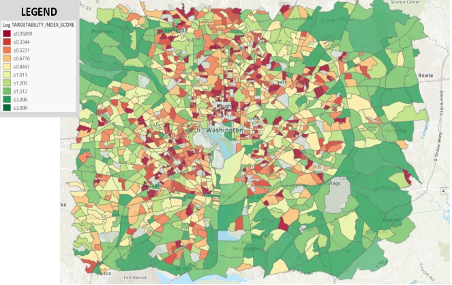
<figcaption>Method 2 - 4.4.2: Log Normalized Using Quantile Class Breaks</figcaption>

4.4.3 Method 3:
Using this method there are 10 different classes with a targetability index score between -0.2235 (highest targetability) and 3.0 (lowest targetability). Red census block groups indicate a higher targetability index score and green census block groups indicate a lower targetability score.

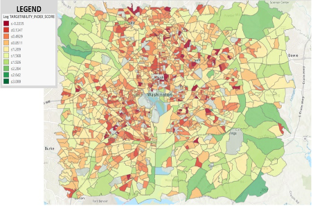
<figcaption>Method 3 - 4.4.3: Log Normalized Using Equal Interval Class Breaks</figcaption>

4.4.4 Method 4: 

Using this method there are 10 different classes with a targetability index score between 41,260,000 (highest targetability) and 561,800,000,000 (lowest targetability). Red census block groups indicate a higher targetability index score and green census block groups indicate a lower targetability score.

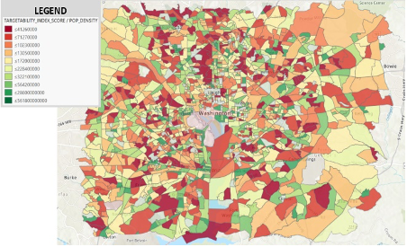
<figcaption>Method 4 - 4.4.4: Log Normalized Using Equal Interval Class Breaks</figcaption>
 
4.4.5 Method 5:  
Using this method there are 10 different classes with a targetability index score between 46,010 (highest targetability) and 1,139,000,000 (lowest targetability). Red census block groups indicate a higher targetability index score and green census block groups indicate a lower targetability score. 

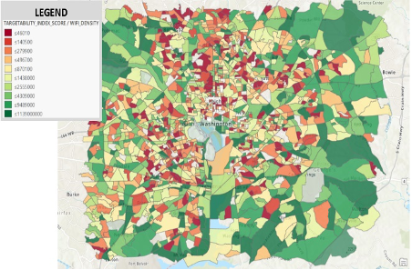
<figcaption>Method 5 - 4.4.5: WiFi Density Normalized Using Quantile Class Breaks</figcaption>

#### Results
Our final analysis relied on a combination of all five visualization techniques referenced in section 4.4 to acquire the most accurate depiction of the top ~10% targetable census block groups (Wi-Fi deserts). Through visual cross-correlation analysis, we identified the most accurate single visualization technique to be Log Normalized Using Standard Deviation Class Breaks. This technique contained the highest number of correlated Wi-Fi desert block groups when compared to all other visualization techniques. Furthermore, we identified that the majority of Wi-Fi deserts are concentrated in five different geographic clusters categorized as

1. Northwest Washington D.C.
2. Hyattsville/College Park
3. Arlington/Springfield
4. Bethesda/N. Bethesda
5. Downtown Washington D.C. (see figure 5.1).

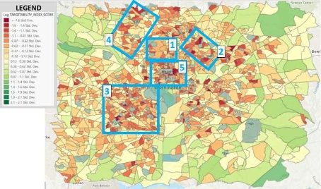
<figcaption>Figure 5.1 – Highest Targetability Concentration Areas</figcaption> 

Although the Log Normalized Using Standard Deviation Class Breaks visualization technique proved to be the most accurate when compared against all others, we can see that clusters 1 & 4 visually do not immediately stand out as having high targetability scores. However, when referencing method 4: Population Density Normalization and method 5: Wi-Fi Density Normalization, these areas are higher in targetability than others. Interestingly, methods 1, 2, & 3 indicate very significant targetability scores in downtown Washington D.C., while methods 4 & 5 indicate negligible targetability in all of the downtown census block groups except for two small-block groups in the Bloomingdale area. This is most likely due to the nature of using crowdsourced Wi-Fi data. Figure 4.3.2 highlights the significantly unbalanced density ratio of WiGLE data collected inside downtown D.C. to other areas, probably due to the number of people using the application there. Visualization methods 4 & 5 are normalized on population density and Wi-Fi density, providing a more accurate depiction in this region. 
Bottom Line: Proportionately, when all visualization techniques are taken into account, the highest density of Wi-Fi deserts are within clusters 1, 2 & 3, making these areas the most desirable for follow-on 5G network site surveys. Furthermore, the identified Wi-Fi desert clusters can be categorized as mostly suburban areas (outside of a few census blocks groups in cluster 1). Based on this information, we reject Hypothesis 2 and can say that Hypothesis 1 is mostly correct.

#### Further Discussions:
Considering our team lives, works, and studies within the greater Washington DC area, we decided to target our local area.  With the outcome of our paper, future research can be done on other major metropolitan areas like New York City, Los Angeles, and Chicago or even more rural areas.  The Washington DC area is smaller in population density than the aforementioned cities.  Population density and size of a metropolitan area can affect the outcome of the research.  New York City is the highest populated city but has a smaller area than many other cities.  In New York City’s case, the Wi-Fi deserts would likely be small to nonexistent.  With a high population density, there is a concern of reliability or congestion of the 5G towers.  This concern adds a level of complexity that our research did not account for because the reliability of the 5G tower would depend on the manufacturer’s technical specification and quality control measures which are outside of our research’s data collection scope.  The Washington DC greater area or Chicago Metropolitan are similar in population density, but Chicago is about twice the area of DC. 
While very densely populated cities may not yield the greatest results when using WiGLE records to identify future network site surveys, it may work well in smaller cities with more suburban populations. These areas are likely to have enough WiGLE data points for thorough analysis without being too congested to effectively determine Wi-Fi deserts. Oppositely, if an area is too rural, the probability of low WiGLE records increases substantially. This would also result in poor and uneven analysis, making this research methodology less useful in these areas. Ultimately however, this research provides a highly valuable, free virtual site survey methodology for the majority of geographic areas where telecom/ISPs and government entities are most concerned with and should be used to make network site surveys more efficient.

#### References:
    
1. "Internet," Encyclopedia of Espionage, Intelligence, and SecurityEspionage Information, [Online]. Available: http://www.faqs.org/espionage/In-Int/Internet.html.
2. O. Andrew, "The History and Evolution of the Smartphone: 1992-2018," TEXT REQUEST, 28 August 2018. [Online]. Available: https://www.textrequest.com/blog/history-evolution-smartphone/.
3. "Difference Between 3G and 4G Technology," Tech Differences, [Online]. Available: https://techdifferences.com/difference-between-3g-and-4g-technology.html.
4. B. &. Arkasha, "Wireless Network Mapping," 6 September 2020. [Online]. Available: https://wigle.net/index..
5. C. f. E. D. Services, "Explore Census Data," United States Census Bureau, 6 September 2020. [Online]. Available: https://data.census.gov/cedsci/.
6. F. Q. e. al, "Interference management issues for the future 5G network: a review," Telecommunication Systems, 2019. [Online]. Available: https://search-proquestcom.mutex.gmu.edu/abicomplete/docview/2224740112/F751F2043FD4C25PQ/6?accountid =14541.
7. M. H. A. a. R. Nordin, "Evolution towards fifth generation (5G) wireless networks: Current trends and challenges in the deployment of millimetre wave, massive MIMO, and small cells," Telecommunication Systems, 2017. [Online]. Available: https://search-proquestcom.mutex.gmu.edu/abicomplete/docview/1873290978/F751F2043FD4C25PQ/5?accountid =14541.
8. C. W. E. N. A. J. C. &. L. C. Ranaweera, "5G C-RAN With Optical Fronthaul: An Analysis From a Deployment Perspective," Journal of Lightwave Technology, Vol. 36, No. 11,, 2018. [Online]. Available: https://ieeexplore-ieee-org.mutex.gmu.edu/document/8194738.
9. Ookla, "Ookla 5G Map," Ookla, 2020. [Online]. Available: https://www.speedtest.net/ookla-5g-map.
10. C. W. E. N. A. J. C. &. L. C. Ranaweera, "5G C-RAN With Optical Fronthaul: An Analysis From a Deployment Perspective," Journal of Lightwave Technology, Vol. 36, No. 11,, 2018. [Online]. Available: https://ieeexplore-ieee-org.mutex.gmu.edu/document/8194738 .
11. P. S. A. G. R. &. L. S. Sapiezynski, "Tracking Human Mobility Using WiFi Signal," Public Library of Science One, San Fransisco, Vol. 10, Iss. 7 (Jul 2015): e0130824. DOI:10.1371/journal.pone.0130824, [Online]. Available: https://search-proquest-com.mutex.gmu.edu/docview/1692759813?accountid=14541&rfr_id=info%3Axri%2Fsid%3Aprimo.
12. "5G: First An Evolution, Then A Revolution," FitchSolutions, 10 April 2019. [Online]. Available: https://search-proquest-com.mutex.gmu.edu/abicomplete/docview/2206384219/CED987A8395346A4PQ/11?accountid=14541.
13. "5G Speed: How Fast is 5G?," Verizon, 3 August 2020. [Online]. Available: https://www.verizon.com/about/our-company/5g/5g-speed-how-fast-is-5g.
14. W. H. Chin, "Emerging Technologies and Research," July 2013. [Online]. Available: https://arxiv.org/ftp/arxiv/papers/1402/1402.6474.pdf.
15. D. Fang, "Security for 5G Mobile Wireless Networks," August 2017. [Online]. Available: https://digitalcommons.usu.edu/cgi/viewcontent.cgi?article=1205&context=ece_facpub.
16. "Fixed Broadband Deployment.” Federal Communications Commission," FCC.gov., 15 November 2020. [Online]. Available: https://broadbandmap.fcc.gov/#/.
17. Wansink, "Global Mobile Infrastructure - 5G Activity Escalates Around the World," 10 July 2019. [Online]. Available: https://search-proquest-com.mutex.gmu.edu/abicomplete/docview/2404633476/CED987A8395346A4PQ/7?accountid=14541.
18. D. Catalog, "TIGER/Line Shapefile, 2019, State, Maryland, Current Block Group State-Based," Data.gov, 2019. [Online]. Available: https://catalog.data.gov/dataset?collection_package_id=9f75bbdb-a865-47fd-ae5b-90026ef2091d&page=3.
19. D. Catalog, "TIGER/Line Shapefile, 2019, State, Virginia, Current Block Group State-Based," Data.gov, 2019. [Online]. Available: https://catalog.data.gov/dataset?collection_package_id=9f75bbdb-a865-47fd-ae5b-90026ef2091d&page=3.
20. D. Catalog, "TIGER/Line Shapefile, 2019, State, District of Columbia, Current Block Group State-Based," Data.gov, 2019. [Online]. Available: https://catalog.data.gov/dataset?collection_package_id=9f75bbdb-a865-47fd-ae5b-90026ef2091d&page=3.
