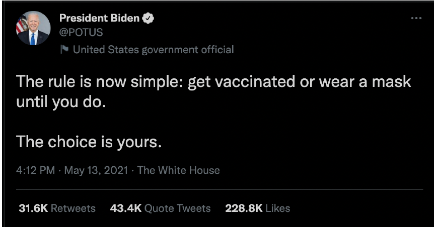

## Authors:
Paul Barry
Ewin Hong
Yasas Wijesuriya
 

### Network Analysis of Quoted Tweets

#### Introduction

How does information propagate within Twitter?

Now let's start off with a quick introduction to our project. Our goals for this project were fairly
simple. First, we wanted to get a better understanding of how information is propagated within
Twitter's network. Second, we wanted to better understand how members of a community
interact with and relate to one another. Lastly, we wanted to understand how information
flows into communities that are geographically distant from the original post.

How does community members interact with one another

To best explore these areas, we needed a large network that clearly captures the flow of
information from the source tweet, in our case the root of the graph, to each member of
twitter that participated in the conversation. Naturally, the President's tweets are
viewed, retweeted, quoted, and replied to by a very broad audience so we chose to use his
tweets as the basis for our graph.

How does information flows into geographically distance communities

For example, President Biden made the tweet you see below. At the bottom of the image, we
can see that this one tweet was retweeted more than 31 thousand times and quoted more than
43 thousand times. Those numbers are only for direct integrations with this tweet and don't
include the interactions of people two, three, four, and so on hops from the President. This just
goes to show how many people are exposed to the information the President posts on Twitter.

We'd next like to further expand on why we selected the POTUS twitter account instead of
many other active accounts. The first reason is that POTUS's twitter account is being followed
by 15.8 million users on twitter. This gives any of his tweets the potential to go viral, or be seen
by non followers, with minimal effort on POTUS's behalf. The second reason is that the POTUS
account tweets several times a day. Between the account's inception on January 13th 2021 and
today, it has tweeted 2,069 times. That's an average of 6.27 tweets per day. Thirdly, POTUS's
tweets are well formed ideas with explicit goals written into the tweet body. His tweets also
address a single topic and don't blend topics together or leave much room for ambiguity.
Because of this, it is easier to categorize his tweets into topics than other twitter users. Lastly,
and because of his importance, his tweets span multiple continents which is aligned with our
research goal of information flowing into geographically distant regions.

With all of that in mind, lets move on to discuss our hypotheses.

1. Flow of information into a community consistently comes from
the same member(s) of a community
2. The same communities actively participate in discussions of the same topic
3. The time that it takes for information to propagate into a
community will be consistent

#### Methodology

This flowchart is a high level view of the implementation of our architecture.

We used the Twitter Developer API Academic Research Level.

We collected POTUS tweets starting from January 20, 2021 and end 9 months from January
20th. Then pulled the top 100 tweets that had the highest quoted count.

Other Sampling Strategies? In our analysis, we only considered highest quoted tweets to
collect significant number of tweets for analysis. In future, we plan to study other techniques
to sample seed tweets such as sampling based on conversation topic.

Why 100 Tweets? Here we have identified 100 tweets to collect a substantial number of users
in the network with engagement with multiple conversations. We also tested with smaller seed
set of tweets (e.g., 5, 10, 30), however they did not satisfy above criteria.

We then collected the corresponding quoted tweets from the POTUS tweets. Each tweet has
id and a userid

Within our graph, the nodes were the user’s id and edges had a source and target to a user id
and edges used tweet id as Id

##### Tools / Algorithms

We used several tools and languages for our analysis. First, we used Twitter API and python to
download and collect the data. Then used python to preprocess the data and to create tweet
the network. After we used Gephi to visualize and calculate the measures we need for analysis.
Finally, we analyzed the network both qualitatively and quantitatively. We again used
Python/Power shell scripts for analysis.

For analysis we used several algorithms. Force Atlas 2 was used for layout to get a cleaner
visualization. Then Betweenness centrality was calculated to measure the importance of users
for analyzing information flow. We also calculated the communities for understanding the
group behavior of users.

##### Challenges

Retweets don’t show discourse within a community

Deciding what metadata about a user to keep in the network to
assist with community analysis

Private and suspended accounts provide an incomplete picture
of information flow.

##### Data

#of POTUS Tweets: 100

#of Tweets: 58908

#of Users: 18646

#of Nodes: 10731

#of Edges: 26836

These are the different statistics for the data we collected. We started with 100 POTUS tweets
as described in previous slides. We collected 58900 Tweets in the tweet collection process,
which consisted of around 18600 users. After preprocessing, we obtained around 10700 nodes
that represented users and around 26800 edges that shows communications between them.
Preprocessing included removal of nodes that did not participate in conversation with POTUS
account due to unavailability of intermediate edges.

##### Network Communities Visualization

Here is the network that we obtained after visualization with Gephi using Force Atlas 2 layout.
Colors represent the community of the user obtained by running modularity on the network.

On the right hand side, we show the percentage of members in communities in the network.
The community with maximum number of nodes contained ~17% of the total nodes.

In the next few slides, we will discuss how we did our analysis along with the results of those
analysis.

#### Results

Hypothesis 1: Member Importance

Our first hypothesis is that the flow of information into a community consistently comes from
the same member(s) of a community. On a micro level, we see that this hypothesis holds. For
example, jasonnyboy quoted or replied to the comments of 14 other accounts and this
information then flowed down to 51 other users. To identify jasonnyboy we used modularity to
detect communities. We then did a visual analysis to identify bridges nodes in the graph that
belonged to a single community. We did an analysis on the downstream users in an effort to
identify similarities, but no strong similarities were present. Video gamers and middle aged
women seemed to be present more than other demographics, but it wasn't clear if this was
specific to this community or if they were disproportionate part of Twitter's user base at large.
Further, Geographic location seemed to be highly variable with none of the users being from
NY as jasonnyboy's name would suggest nor Baltimore the location reported on his profile.

Another example is the account chenweihua who is a columnist for the China Daily publication.
chenweihua quoted or replied to the comments of 4 other accounts and directly commented
on the President's tweets 4 different times. His tweets allowed information to flow to many
downstream users, 32 of which were directly dependent on his tweets. We identified
chenweihua by using betweenness centrality to detect nodes with high centrality in densely
populated areas of the graph. Unlike jasonnyboy's community, which was one of the farthest
communities from the center of the graph, chenweighua was relatively close to the center and
difficult to identify using only community detection as he was a member of POTUS's
community which included almost 17% of all users in the graph. Due to his role, we expected
that downstream users would be chinese and that analyzing the community would show how
western news propagates into China. Unfortunately, this wasn't the case. Most of the users
were from the western hemisphere, a likely consequence of the number of Chinese people who
can access to Twitter.

On a macro level, we can safely say the first hypothesis fails. All of the larger communities have many entry points and cannot be isolated to bridge nodes. We suspected news organizations
would be major participants in the spread of information, especially to geographic location like
England in the case of BBC and the Middle East in the case of Al Jazeera.

However, that wasn't the case. Of course, we believe that news organizations do contribute to the spread of information from the president, but not in a way that references POTUS's
conversation_id within twitter. That is to say, they create original tweets with links to articles
which discuss the same topics POTUS is tweeting about, but don't directly quote or reply to POTUS's tweet and thereby lose the
conversation_id

Because of this, we see regular users spread information through twitter in a conversational manner which removes the single points of failure. The image we see on the slide is a
visualization of one of these communities. We used modularity to detect this community which
is composed of the 161 users in pink. The orange nodes in the upper right corner belong to the same community as POTUS. While difficult to see, the micro level trends discussed in the
previous slide remain true in this community. However, information flow is not constrained to a
single bridge node and instead gets into the pink community through 22 different pink users making hypothesis 1 false on a macro level.

Hypothesis 2: Topic Consistency

Next, I will go through our second hypothesis where we try to understand the topic consistency. Here consistency meant to describe how consistent the users are about engaging in a conversation to same topic. First, we decided to explore the participation of members in multiple conversations (based on conversation id). We observed that only 24% of the members in the entire network participated in more than one conversation. The image on the right shows the distribution of conversations for who participated in multiple conversations. We see a distribution similar to power law distribution here. This means that many users have less chance in participating in multiple conversations.

Next, we wanted to identify the community participation on conversations. We identified that on average only 17.7% participated in multiple conversations within each community. However,if we consider communities as a whole, we observed that 44% of the communities participated in multiple conversations. Therefore, we see a participation in conversations at community level is much higher than at individual level. The distribution of % of users who participated in multiple conversations of communities is provided on the right. In general, the number of communities decrease as % of multiple participation increase.

We also compare % of participation of users in multiple conversations with the size of communities. We observe that as community size grows there is higher percentage of participating in multiple conversations.

In the analysis so far, we only found the participation of users in multiple conversations. It does not necessarily mean they
participated in similar conversation based on topic. To solve this, we identified the topics of Tweet based on the context
information metadata provided in a tweet. Each tweet is annotated with different discussed topics and those are used here. Let
those topics be t and community be represented with c. We define consistency as the ratio of number of users participated in a
given topic in a community to total number of users in that community. This way conversations about same topic by all members
will provide a topic consistency of 1. Then we average the consistencies of each observed topic for each community and obtain
average topic consistency.

This is the plot of topic consistency against the size of community. We observe that mean topic consistency is high across different community sizes. While there is a trend of
decreasing average consistency with size of community, we observe that the consistency
values are still considerably higher (In many cases the consistency is larger than 0.5).

Hypothesis 3: Information Propagation

To analyze this hypothesis, we compared the POTUS group of quoted tweets and communities of quoted tweets. In the POTUS group of quoted tweets, we calculated the time difference (in minutes) from original tweet to the quoted tweets and aggregated the result.  In the communities of quoted tweets, we took the earliest tweet's in community and compare it to every other tweet in community.We determined that picking the middle of the tweets by community member provided a gauge for the POTUS grouped tweets and the community quoted tweets. In the community process, community with less than 11 member and greater than 300 nodes were eliminated (N = 338, n = 61).  No tweet group from POTUS were eliminated.

In this chart, the x axis is the # of tweet group members associated to the original POTUS tweet, and the y axis is the time difference from the original POTUS tweet to the middle of the tweet group.  The points in the charts are largely grouped together towards origin of chart. One item to note is that the majority of POTUS tweet group range between zero to 16 hours (1000 minutes). The size of the tweet group does not appear to change the time difference within the group. The tweet group closest to the 4000 minutes has 36 members in it. The group started on January 27 and ended on February 5th. Most of the tweet group were on January 27 to 30 with 30 members.

In this chart, the x axis is the # of community members, and the y axis is the time difference from the starting tweet of community to the middle.  The distribution on this chart has larger spread. The majority of communities time difference close to zero to 1000 minutes.  The size of the community does not appear to affect the time difference for most of the group.  The community at 300k minutes in chart started with January 20, 2021. Then a single tweet on April 9th. Then conversation started at August 16th and continue for two days. In this 2 day period, there were 31 members.

Both group had commonality where the either tweet group and community had a time difference around 1000 minutes (about 16 and a half hours).  The POTUS tweet group had a tighter distribution and a few outliers (5) while the community group had a larger range of distribution and more datapoints that are outside the main concentration of data point.  The 300k tweet was POTUS 1st official tweet.POTUS tweet “There is no time to waste when it comes to tackling the crises we face”.  This community is generally responding to the crisis of exiting Afghanistan.  This community group is one example that demonstrates calculating what point of community
to pick requires more analysis in data.  A possible algorithm adjustment is to compare each tweet to every other tweet in the
community and pick the data point that covers the majority of the dataset within a 65% range of community datapoints.

Try sampling methods based on topic distribution for selecting seed Tweets
Further analysis is needed to determine algorithmically which point of a community can be used as a community’s
comparison point instead of picking the halfway point of a
community when analyzing information propagation.

#### Conclusion

1. Flow of information into a community consistently comes from
the same member(s) of a community True at the micro level,
False at the macro level
2. Smaller communities participated in discussions of the same
topic while larger communities tend to discuss multiple topics
3. The time that it takes for information to propagate into a
community will be consistent Additional Analysis needed

